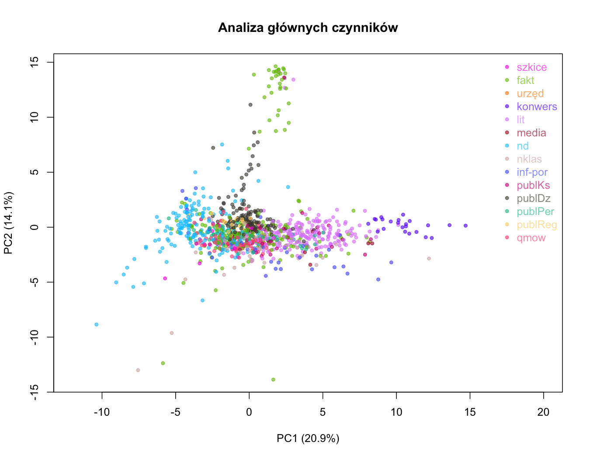

## Typologia tekstów oparta na miarach kwantytatywnych: studium korpusowe o zróżnicowaniu polszczyzny

**Maciej Eder**, **Rafał L. Górski**

Poniżej zamieszczamy rysunki z artykułu w wersji kolorowej.

Artykuł stara się odpowiedzieć na pytanie, czy możliwe jest ustalenie typologii polskich tekstów w oparciu wyłącznie o ich cechy gramatyczne. Dodatkowym celem było ustalenie, czy typologia przyjęta w Narodowym Korpusie Języka Polskiego, oparta na kryteriach pozajęzykowych, rzeczywiście grupuje teksty, które są  do siebie gramatycznie podobne.

Badanie przeprowadzono na korpusie 1190 tekstów wybranych losowo z Narodowego Korpusu Języka Polskiego. Zbadano frekwencję ok. 60 cech gramatycznych w każdym z tekstów, takich jak liczba słów należących do poszczególnych części mowy bądź występujących w konkretnym przypadku, osobie lub czasie gramatycznym itp. Na podstawie  tych danych przeprowadzono analizę Bootstrap Consensus Network, a także skalowanie wielowymiarowe. Rezultaty potwierdzają, że większość tekstów przynależnych w NKJP do danego typu rzeczywiście wykazuje wzajemne podobieństwo.

_Rys. 1: Sieć podobieństw pomiędzy tekstami._

_Rys. 2: Analiza głównych czynników. Wersja interaktywna rysunku znajduje się [tutaj](https://computationalstylistics.github.io/typology_of_texts/rys_2.html)_ 

_Rys. 2: Analiza głównych czynników: najmocniejsze predyktory._

[Figure 4](https://computationalstylistics.github.io/typology_of_texts/rys_4.html)

[Figure 5](https://computationalstylistics.github.io/typology_of_texts/rys_5.html)

